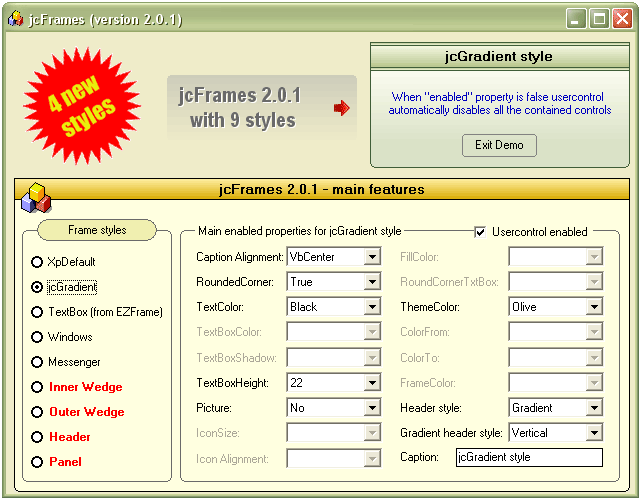



## jcFrames control version 2\.0\.1

### Description

jcFrames control version 2.0.1 (another version of my award-winning frame control) incorporates 4 new styles and new properties (for example: enabled property, it enables or disables automatically all the contained controls). This control will enable you to have new designs on your vb projects. This control provides 9 styles (including Windows XP style) for your frames and different features (caption alignments, textcolor, fillcolor, iconsize, picture,icon alignments, enabled, etc.).
 
### More Info
 

             |
---                |---
**Submitted On**   |2006-02-08 09:38:46
**By**             |[Juan Carlos San Román](https://github.com/Planet-Source-Code/PSCIndex/blob/master/ByAuthor/juan-carlos-san-rom-n.md)
**Level**          |Intermediate
**User Rating**    |5.0 (179 globes from 36 users)
**Compatibility**  |VB 5\.0, VB 6\.0
**Category**       |[Custom Controls/ Forms/  Menus](https://github.com/Planet-Source-Code/PSCIndex/blob/master/ByCategory/custom-controls-forms-menus__1-4.md)
**World**          |[Visual Basic](https://github.com/Planet-Source-Code/PSCIndex/blob/master/ByWorld/visual-basic.md)
**Archive File**   |[jcFrames\_c197111282006\.zip](https://github.com/Planet-Source-Code/juan-carlos-san-rom-n-jcframes-control-version-2-0-1__1-64261/archive/master.zip)

